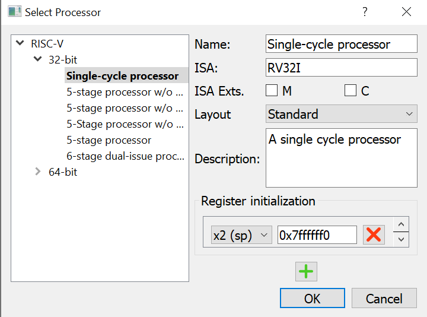

# RISC-V - Balance Sheet

The goal of this assignment is to write a simple RISC-V program that performs addition and subtraction.

## Setup

Use the [Ripes](https://github.com/mortbopet/Ripes) RISC-V simulator to develop and test the program for this assignment. You can [download](https://github.com/mortbopet/Ripes/releases) the latest release and run it on your computer, or use the [web-based version](https://ripes.me) in your browser.

Once loaded, click the `Select processor` icon in the toolbar to configure the simulated CPU. Change the CPU to a 32-bit, single-cycle CPU using the RV32I base ISA. Uncheck the ISA extensions. The settings dialog should look like this:

## Requirements

Define the following variables in the **read-only data section** using the `.rodata` directive.

| Variable Name | Data Size | Initial Value |
|:----|:--|:--|
| `NonCurrentAssets` | 32 bits | `380100` |
| `AccountsReceivable` | 32 bits | `1357` |
| `Cash` | 32 bits | `92524` |
| `NonCurrentLiabilities` | 32 bits | `207120` |
| `AccountsPayable`| 32 bits | `122141` |
| `TaxLiabilities` | 32 bits | `1892` |
| `ShareCapital` | 32 bits | `512` |
| `RetainedEarnings` | 32 bits | `142316` |

Define the following variables in the **read/write data section** using the `.data` directive.

| Variable Name | Data Size | Initial Value |
|:----|:--|:--|
| `TotalAssets` | 32 bits | `0` |
| `TotalLiabilities` | 32 bits | `0` |
| `TotalShareholderEquity` | 32 bits | `0` |

The variables represent the values on a balance sheet for a company. The program must compute the total of each section in the balance sheet and update the associated variables:

- `TotalAssets` = `NonCurrentAssets` + `AccountsReceivable` + `Cash`
- `TotalLiabilities` = `NonCurrentLiabilities` + `AccountsPayable` + `TaxLiabilities`
- `TotalShareholderEquity` = `ShareCapital` + `RetainedEarnings`

## Bonus

After computing the three section totals, check if the balance sheet is actually balanced. The following formula must hold true:

- `TotalShareholderEquity` = `TotalAssets` - `TotalLiabilities`

Write RISC-V assembly code that checks if the sheet is balanced and takes one of the following actions:

- If balanced, put the value `100` in the `x10` register.
- If not balanced, put the value `200` in the `x10` register.
